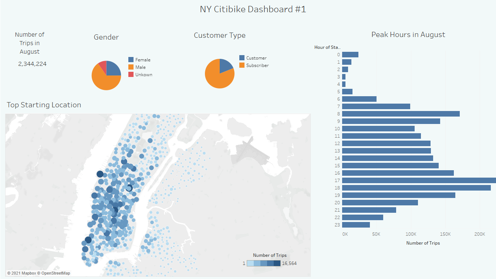
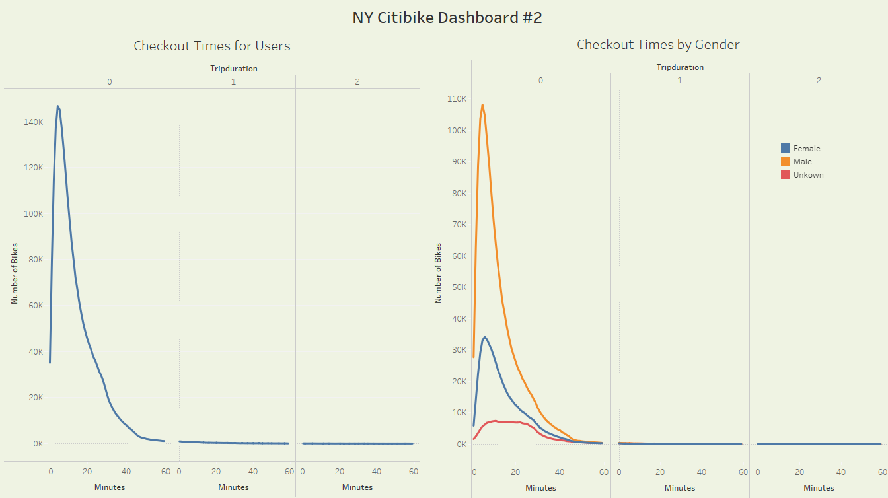
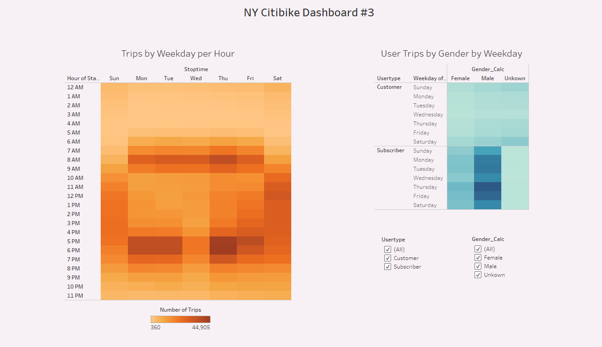
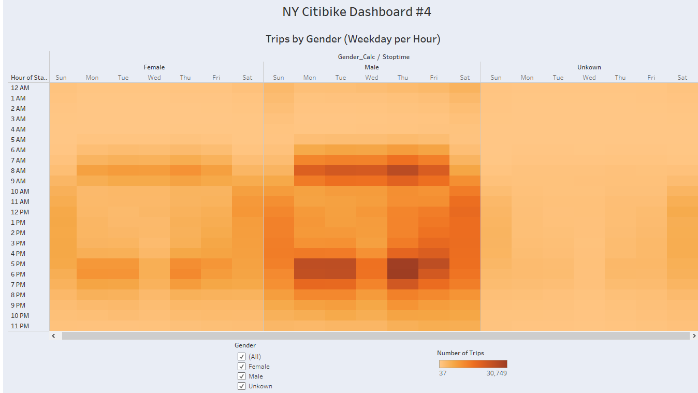

# NY Citibike Bikesharing

# Overview

- We need to convince investors that a bike-sharing program in Des Moines is a solid business proposal. To solidify the proposal, we will conduct a bike trip analysis and produce a set of visualizations to include in the report for the final presentation. Using Tableau, we will create visualizations that show:

    1) How long bikes are checked out for all riders and genders.

    2) How many trips are taken by the hour for each day of the week, for all riders and genders.
    
    3) A breakdown of what days of the week a user might be more likely to check out a bike, by type of user and gender.

    4) Two or more additional visualizations from your previous analysis to bolster the presentation.

# Results
[Click here to view the interactive Tableau story or continue below for a breakdown of each slide.](https://public.tableau.com/profile/alex.forbis#!/vizhome/NYCitibikeWorkbook_Final/NYCitibikeStory)

   1) Dashboard #1: (a) Number of trips in August, (b) Number of trips by gender, (c) Number of trips by user type, (d) Number of trips per hour, and (e) Number of trips by location.

   

   - There were 2,344,224 bike trips in August. 
   - 65% of trips were from men, 25% women, and 10% unknown. 
   - 81% of trips were from subscribers and 19% were customers.
   - Peak trip hours were 5pm and 6pm, respectively.
   - The highest number of trips started near Grand Central Station (40.7519, -73.9777).

   2) Dashboard #2

   

   Analysis...

   3) Dashboard #3
    
   

   Analysis...

   4) Dashboard #4

   
